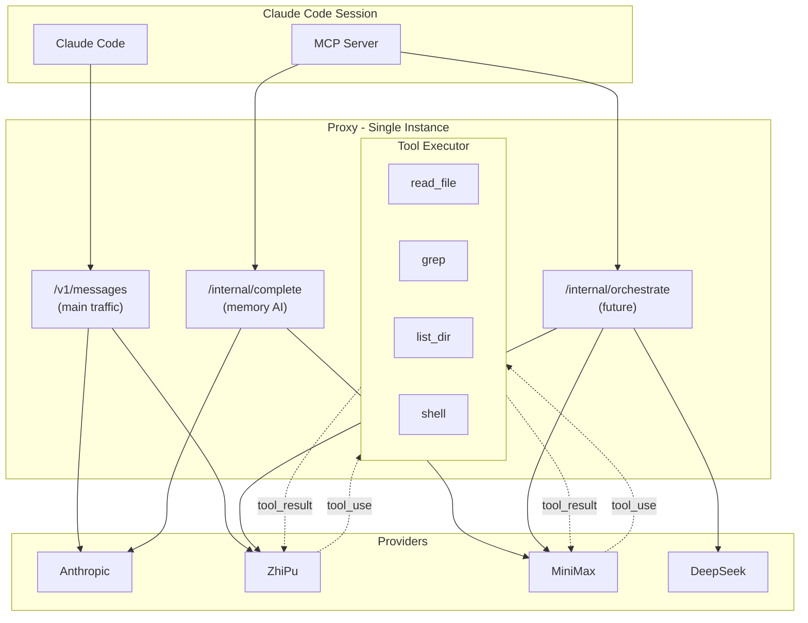

# Orchestrator Architecture — Future Bridge Replacement

> **Status**: Design document only. No code changes. Architecture from Memory
> System Enhancement v3 explicitly supports this migration path.

## Context

The current bridge system (`bridge_send` → tmux pane → poll output) works but
has limitations:

- **Fragile I/O**: Relies on tmux pane text capture, which can miss content or
  include terminal artifacts
- **No structured responses**: Bridge workers return raw text, not typed results
- **No tool routing**: Can't intercept or route tool calls from bridge workers
- **Single model per worker**: Each CC bridge worker is locked to one provider

## Future Architecture

The `/internal/complete` endpoint (introduced in Memory System Enhancement v3)
becomes the foundation for a proper orchestrator:

```
Current bridge:
  bridge_send → daemon → pane inject → poll pane output → raw text

Future orchestrator:
  orchestrate → /internal/complete → SSE parse → structured result
  orchestrate → /internal/complete (tool_use) → tool routing → result
```

## Key Design Principles

### 1. Proxy as Universal AI Gateway

All AI traffic (main session, memory, orchestration) flows through the same
proxy:

```
/v1/messages          → Main Claude traffic (session switch state)
/internal/complete    → Memory AI (independent routing)
/internal/orchestrate → Future: multi-turn orchestration with tool support
```

### 2. Provider-Agnostic Tool Routing

When a third-party provider returns a `tool_use` response, the orchestrator:

1. Parses the tool call from the provider's response format
2. Executes the tool locally (file read, grep, etc.)
3. Sends the tool result back to the provider for continuation
4. Repeats until the provider returns a final text response

This gives third-party models tool-calling capabilities similar to Claude Code,
but routed through our proxy.

### 3. SSE Streaming Support

The orchestrator endpoint supports Server-Sent Events for real-time streaming:

```typescript
// Future endpoint
POST /internal/orchestrate
{
  messages: [...],
  provider: "minimax",
  model: "MiniMax-M2.5",
  tools: ["read_file", "grep", "list_dir"],
  stream: true
}
```

### 4. Format Conversion Layer

Different providers use different API formats:

| Provider  | API Format           | Tool Format                |
| --------- | -------------------- | -------------------------- |
| Anthropic | Messages API         | content blocks             |
| OpenAI    | Chat Completions     | function_call / tool_calls |
| ZhiPu     | Anthropic-compatible | content blocks             |
| MiniMax   | Anthropic-compatible | content blocks             |
| DeepSeek  | Anthropic-compatible | content blocks             |

The proxy's existing format conversion (`response-builders.ts`) handles most of
this. The orchestrator extends it with tool-call parsing.

## Migration Path

1. **Phase 1 (Done)**: `/internal/complete` — non-streaming completion for
   memory ops
2. **Phase 2 (Future)**: Add streaming support to `/internal/complete`
3. **Phase 3 (Future)**: Add `/internal/orchestrate` with single-turn tool
   routing
4. **Phase 4 (Future)**: Multi-turn tool loop (provider sends tool_use → execute
   → send result → repeat)
5. **Phase 5 (Future)**: Replace bridge workers with orchestrator-backed agents

## Data Flow Diagram



## Open Questions

1. **Security**: Tool execution in the proxy process needs sandboxing. Should we
   use a separate worker?
2. **Concurrency**: How many simultaneous orchestration sessions can the proxy
   handle?
3. **Context window**: Third-party models have different context limits. How do
   we handle tool result accumulation?
4. **Plugin API**: Should this integrate with Claude Code's plugin/co-worker
   system when available?
